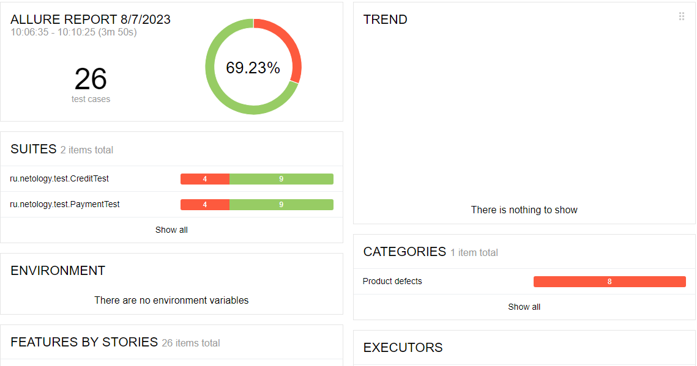
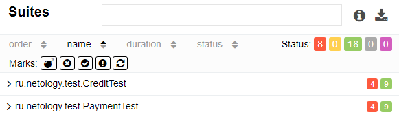

## Отчетные документы

**Описание**

Выполнена автоматизация тестирования сервиса по покупке туристического тура, взаимодействующего с СУБД.

Приложение тестировалось двумя способами оплаты:

- Оплата по дебетовой карте
- Выдача кредита по данным банковской карты

Заявлена поддержка двух СУБД:

-   MySQL
-   PostgreSQL

**Статистика выполнения тест-кейсов:**

Всего выполнено 26 тест-кейсов

18 тест-кейсов (69,23%)  успешных

8 тест-кейсов (30,76%) неуспешных

**Отчет Allure**

**Рекомендации:**
1. Разработать документацию на ПО веб-сервиса.
2. Устранить выявленные баги.
